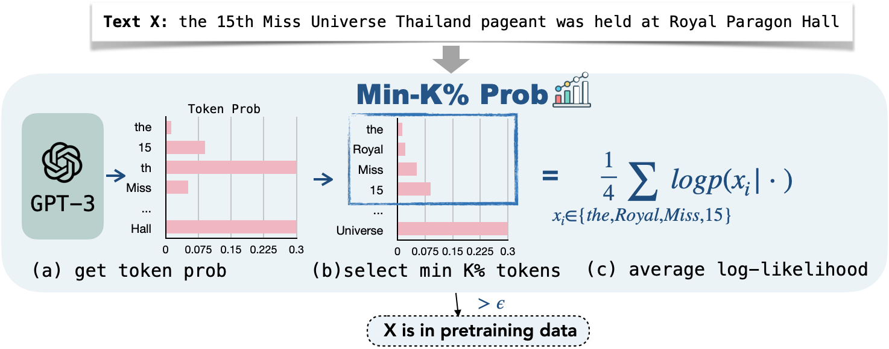

# :detective: Detecting Pretraining Data from Large Language Models

This repository provides an original implementation of [Detecting Pretraining Data from Large Language Models](https://arxiv.org/pdf/2310.16789.pdf) by *Weijia Shi, *Anirudh Ajith, Mengzhou Xia, Yangsibo Huang, Daogao Liu
, Terra Blevins
, Danqi Chen
, Luke Zettlemoyer

[Website](https://swj0419.github.io/detect-pretrain.github.io/) |  [Paper](https://arxiv.org/pdf/2310.16789.pdf) | [WikiMIA Benchmark](https://huggingface.co/datasets/swj0419/WikiMIA) |  [BookMIA Benchmark](https://huggingface.co/datasets/swj0419/BookMIA) | [Detection Method Min-K% Prob](#🚀run-our-min-k%-prob-&-other-baselines)(see the following codebase) 

## Overview
We explore the **pretraining data detection problem**: given a piece of text and black-box access to an LLM without knowing the pretraining data, can we determine if the model was trained on the provided text? 
To faciliate the study, we built a dynamic benchmark **WikiMIA** to systematically evaluate detecting methods and proposed **Min-K% Prob** 🕵️, a method for detecting undisclosed pretraining data from large language models. 

<p align="center">
  
</p>

:star: If you find our implementation and paper helpful, please consider citing our work :star: :

```bibtex
@misc{shi2023detecting,
    title={Detecting Pretraining Data from Large Language Models},
    author={Weijia Shi and Anirudh Ajith and Mengzhou Xia and Yangsibo Huang and Daogao Liu and Terra Blevins and Danqi Chen and Luke Zettlemoyer},
    year={2023},
    eprint={2310.16789},
    archivePrefix={arXiv},
    primaryClass={cs.CL}
}
```

## 📘 WikiMIA Datasets

The **WikiMIA datasets** serve as a benchmark designed to evaluate membership inference attack (MIA) methods, specifically in detecting pretraining data from extensive large language models. Access our **WikiMIA datasets** directly on [Hugging Face](https://huggingface.co/datasets/swj0419/WikiMIA).

#### Loading the Datasets:

```python
from datasets import load_dataset
LENGTH = 64
dataset = load_dataset("swj0419/WikiMIA", split=f"WikiMIA_length{LENGTH}")
```
* Available Text Lengths: `32, 64, 128, 256`.
* *Label 0*: Refers to the unseen data during pretraining. *Label 1*: Refers to the seen data.
* WikiMIA is applicable to all models released between 2017 to 2023 such as  `LLaMA1/2, GPT-Neo, OPT, Pythia, text-davinci-001, text-davinci-002 ...`

## 📘 BookMIA Datasets for evaluating MIA on OpenAI models

The BookMIA datasets serve as a benchmark designed to evaluate membership inference attack (MIA) methods, specifically in detecting pretraining data from OpenAI models that are released before 2023 (such as text-davinci-003). Access our **BookMIA datasets** directly on [Hugging Face](https://huggingface.co/datasets/swj0419/BookMIA).

The dataset contains non-member and member data: 
- non-member data consists of text excerpts from books first published in 2023
- member data includes text excerpts from older books, as categorized by Chang et al. in 2023.


#### Loading the Datasets:

```python
from datasets import load_dataset
dataset = load_dataset("swj0419/BookMIA")
```
* Available Text Lengths: `512`.
* *Label 0*: Refers to the unseen data during pretraining. *Label 1*: Refers to the seen data.
* WikiMIA is applicable to OpenAI models that are released before 2023  `text-davinci-003, text-davinci-002 ...`


## 🚀 Run our Min-K% Prob & Other Baselines

Our codebase supports many models: Whether you're using **OpenAI models** that offer logits or models from **Huggingface**, we've got you covered:

- **OpenAI Models**:
  - `text-davinci-003`
  - `text-davinci-002`
  - ...

- **Huggingface Models**:
  - `meta-llama/Llama-2-70b`
  - `huggyllama/llama-70b`
  - `EleutherAI/gpt-neox-20b`
  - ...

🔐 **Important**: When using OpenAI models, ensure to add your API key at `Line 38` in `run.py`:
```python
openai.api_key = "YOUR_API_KEY"
```
Use the following command to run the model:
```bash
python src/run.py --target_model text-davinci-003 --ref_model huggyllama/llama-7b --data swj0419/WikiMIA --length 64
```
🔍 Parameters Explained:
* Target Model: Set using --target_model. For instance, --target_model huggyllama/llama-70b.

* Reference Model: Defined using --ref_model. Example: --ref_model huggyllama/llama-7b.

* Data Length: Define the length for the WikiMIA benchmark with --length. Available options: 32, 54, 128, 256.

<span style="color:red;">📌 Note: ***For optimal results, use fixed-length inputs with our Min-K% Prob method***</span> (When you evalaute Min-K% Prob method on your own dataset, make sure the input length of each example is the same.)

📊 Baselines: Our script comes with the following baselines: PPL, Calibration Method, PPL/zlib_compression, PPL/lowercase_ppl

